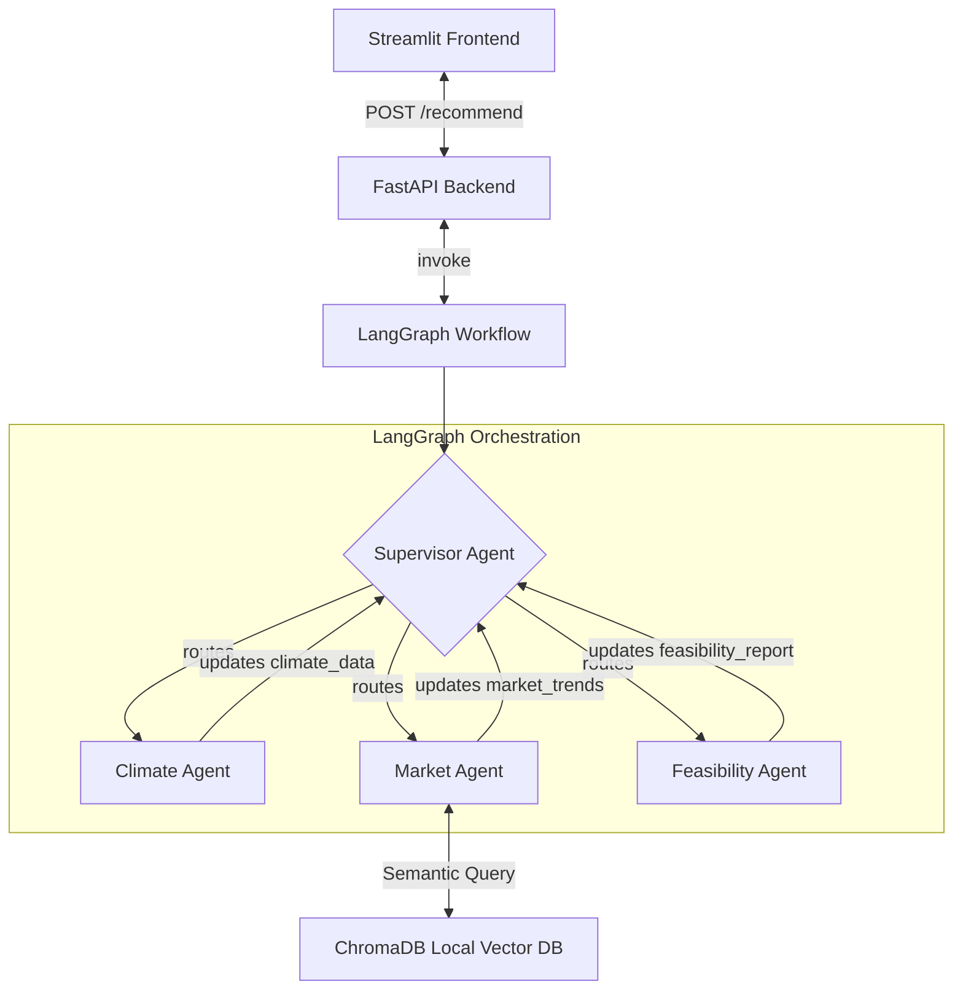

# 🌱 AgriPlan AI

AgriPlan AI is an intelligent, multi-agent agricultural planning and crop recommendation system. It leverages a LangGraph orchestration workflow, local RAG retrieval via ChromaDB, a FastAPI backend, and a premium Streamlit frontend interface to provide customized, data-driven farming insights.

---

## 🏗️ System Architecture

The system utilizes a multi-agent supervisor pattern to sequence research tasks before summarizing final feasibility.



### Agents Workflows & Core Responsibilities

1. **Supervisor Agent**: Monitors the `AgentState`. Programmatically and agentically decides which task to run next based on what data is missing, routing back to `__end__` once all workers finish.
2. **Climate Agent**: Analyzes farm geolocation (latitude, longitude) and soil N-P-K composition to evaluate weather suitability and general soil health.
3. **Market Agent**: Integrates local ChromaDB retrieval to search for real-time market trends and demand fluctuations of target crops.
4. **Feasibility Agent**: Synthesizes the climate reports, market insights, and the farmer's budget limits. It runs under strict budget constraints (filtering out crops whose cultivation cost exceeds available capital) and uses structured LLM outputs to return validated recommendations.

---

## 📂 Project Structure

```text
agriplan-ai/
├── backend/
│   ├── main.py           # FastAPI endpoints & Lifespan setup
│   ├── state.py          # LangGraph shared state (AgentState)
│   ├── agents.py         # OpenAI SDK agent worker & supervisor definitions
│   ├── graph.py          # LangGraph StateGraph routing & compilation
│   ├── database.py       # ChromaDB EphemeralClient setup, paragraph chunking, & RAG loading
│   └── schemas.py        # Pydantic schemas (FarmerInput, CropRecommendation)
├── frontend/
│   └── app.py            # Streamlit UI
├── data/
│   └── market_trends.txt # Seed data for vector store RAG (categorized crop profiles)
├── requirements.txt      # Project dependencies
└── README.md             # System documentation
```

---

## ⚙️ Key Technical Features

### 1. Vector Store Chunking Strategy
To prevent fragmentation of crop profiles during semantic retrieval, `backend/database.py` processes raw crop profiles by splitting the file on distinct paragraphs (`\n\n`). This ensures that agricultural specifications (compatibility, soil requirements, costs, pricing trends, and risk metrics) remain logically grouped inside ChromaDB documents.

### 2. Structured Pydantic LLM Output
The `feasibility_agent` utilizes OpenAI SDK's `.beta.chat.completions.parse()` wrapped with the `CropRecommendation` Pydantic schema. This guarantees that model responses are validated programmatically, outputting pristine JSON with the following structure:
* `crop_name`: The name of the recommended crop.
* `estimated_yield`: Estimated yield metrics (e.g., Tons/Acre).
* `reasoning`: A clear context-aware explanation detailing budget, climate, and market alignment.

### 3. Workflow Lifecycle Management
Workers update their respective state variables and route back to the Supervisor. When the `feasibility_agent` generates the final decision, it updates the state payload with `next_node` set to `__end__`, prompting the Supervisor to immediately terminate the LangGraph execution flow.

---

## 🚀 Setup & Execution

### 1. Prerequisites
Ensure you have Python 3.10+ installed.

### 2. Configure Environment
Set your OpenAI API key in your terminal/environment (pointing to the OpenRouter gateway config or direct OpenAI endpoint as needed):
```bash
# Windows (PowerShell)
$env:OPENAI_API_KEY="your-api-key-here"

# Linux/macOS
export OPENAI_API_KEY="your-api-key-here"
```

### 3. Install Dependencies
Install the required Python packages:
```bash
pip install -r requirements.txt
```

### 4. Run the Backend API
Start the FastAPI server (running on `http://localhost:8000` by default):
```bash
python -m uvicorn backend.main:app --reload
```

### 5. Run the Streamlit Dashboard
Launch the frontend application:
```bash
python -m streamlit run frontend/app.py
```
Open `http://localhost:8501` in your browser to interact with the application.
